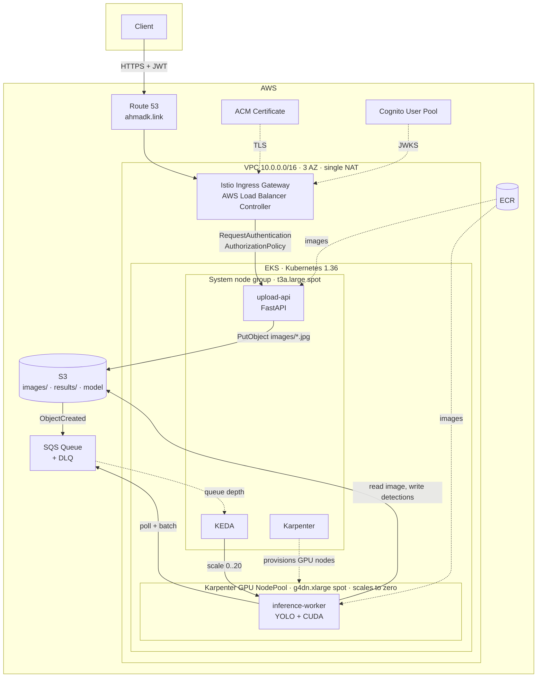

# EKS GPU Inference Platform

A production-shaped Kubernetes platform on AWS EKS that runs GPU inference workloads and **scales the GPU fleet to zero when idle**.

Images are uploaded through an authenticated API, land in S3, trigger an SQS event, and KEDA scales a pool of YOLO inference workers based on queue depth. Karpenter provisions `g4dn` spot nodes on demand and removes them once the queue drains — so the expensive hardware only exists while there is work for it.

Built with Terraform across five independently-applied layers, Istio for north-south traffic and mesh-level JWT enforcement, and GitHub Actions with OIDC (no static AWS credentials anywhere).

---

## Architecture



### Request flow

1. Client authenticates against **Cognito** and calls `POST /upload` with a JWT.
2. **Istio ingress gateway** terminates TLS (ACM cert, DNS managed by external-dns) and the sidecar validates the token against Cognito's JWKS endpoint — `RequestAuthentication` verifies the signature, `AuthorizationPolicy` checks the claim. The application never sees an unauthenticated request.
3. **upload-api** (FastAPI) streams the image to S3 under `images/<uuid>.jpg` using an IRSA-scoped role.
4. **S3 event notification** publishes to SQS, filtered to `images/` + `.jpg`.
5. **KEDA** polls queue depth. Below 50 messages the deployment stays at zero; past that it activates and targets one replica per 80 messages, up to 20.
6. **Karpenter** sees unschedulable GPU pods and provisions `g4dn.xlarge` spot capacity with the `nvidia.com/gpu` taint the workers tolerate.
7. **inference-worker** loads YOLO onto the GPU, batches messages off SQS, runs inference, writes detections back to S3, deletes the messages.
8. Queue drains → KEDA scales to zero → Karpenter consolidates the empty nodes away.

---

## Design decisions

**Why five Terraform layers instead of one state file.** `networking → eks → base_k8s_services → platform_config → app`, wired together with `terraform_remote_state`. The layers have genuinely different change frequencies and blast radii: the VPC changes almost never, the app layer changes every deploy. Separate state means an app mistake cannot corrupt cluster state, and each layer can be applied independently.

**Why Karpenter *and* KEDA.** They solve different halves of the same problem. KEDA scales *pods* on a business signal (SQS depth) — Kubernetes' built-in HPA cannot scale from zero on queue depth. Karpenter scales *nodes* in response to the pods KEDA creates, and it bin-packs and consolidates far more aggressively than Cluster Autoscaler. Neither alone gets you scale-to-zero GPU.

**Why JWT validation in the mesh, not the app.** The Istio sidecar rejects unauthenticated requests before they reach the container. Auth logic lives in infrastructure config rather than being reimplemented in every service, and `upload-api` stays a plain FastAPI app with no auth code in it.

**Why SQS between the API and the workers.** Decouples a latency-sensitive HTTP path from a slow GPU batch job. Uploads succeed in milliseconds regardless of inference backlog, the queue absorbs bursts, and the DLQ (`maxReceiveCount = 5`) catches poison messages instead of letting them spin forever.

**Why spot for both node pools.** The workload is interruption-tolerant — an interrupted batch simply returns to the queue after the visibility timeout. Karpenter's `consolidationPolicy: WhenEmptyOrUnderutilized` with a one-minute window keeps the fleet tight.

**Why IRSA per workload.** Every service account gets its own IAM role with a trust policy scoped to that exact `system:serviceaccount:<ns>:<name>`. The upload API can write to S3; it cannot read the queue. No node-level credentials, no shared roles.

---

## Cost model

The GPU fleet is the entire cost story. `g4dn.xlarge` on-demand runs roughly $0.53/hour, so a single always-on GPU node is about **$390/month**.

This platform runs the same workload for the time the queue is actually non-empty:

| | Always-on GPU node | This platform |
|---|---|---|
| GPU node hours | 720/month | only while queue depth > 50 |
| Capacity type | on-demand | spot (~60-70% discount) |
| Idle cost | full | **$0** |

The permanently-running footprint is one `t3a.large` spot node for the system components plus a single NAT gateway. Everything GPU-shaped is created on demand and consolidated away within a minute of going idle.

---

## Repository layout

```
Infra/
  networking/          VPC, subnets, NAT  (terraform-aws-modules/vpc)
  eks/                 EKS cluster, managed node group, addons, KMS
  base_k8s_services/   Cluster-wide platform components (see below)
  platform_config/     Karpenter NodePool + EC2NodeClass, Cognito user pool
  app/                 Namespace, workloads, S3, SQS, IRSA, Istio + auth policy
  modules/
    albc/              AWS Load Balancer Controller + IRSA
    karpenter/         Karpenter + IRSA + instance profile
    keda/              KEDA + IRSA
    istio/             istio-base, istiod, ingress gateway, ACM lookup
    external-dns/      Route 53 record management
    k8s-gpu-plugin/    NVIDIA device plugin
    fluent-bit/        CloudWatch log shipping
    eks_access_entry/  EKS access entries for IAM principals
    custom_policies/   IAM policy documents
  infra.sh             Ordered apply/destroy across layers

apps/
  upload-api/          FastAPI upload service
  inference-worker/    YOLO batch inference worker

.github/workflows/     Build + push to ECR, deploy via OIDC
```

Each layer keeps its own state in S3 and consumes the layer below it through `terraform_remote_state` outputs.

---

## Getting started

**Prerequisites:** AWS account, Terraform, `kubectl`, an S3 bucket for state, a Route 53 hosted zone with an ACM certificate.

```bash
cd Infra
./infra.sh create      # applies all five layers in dependency order
```

```bash
aws eks update-kubeconfig --region us-east-1 --name Ahmad-EKS
kubectl get nodes
kubectl get pods -n gpu-inference
```

Upload an image:

```bash
TOKEN=$(aws cognito-idp initiate-auth \
  --auth-flow USER_PASSWORD_AUTH \
  --client-id <client-id> \
  --auth-parameters USERNAME=<user>,PASSWORD=<password> \
  --query 'AuthenticationResult.IdToken' --output text)

curl -X POST https://upload.<your-domain>/upload \
  -H "Authorization: Bearer $TOKEN" \
  -F "file=@image.jpg"
```

Then watch the platform react:

```bash
kubectl get pods -n gpu-inference -w     # KEDA scaling workers up from zero
kubectl get nodes -w                     # Karpenter provisioning GPU capacity
```

Teardown:

```bash
./infra.sh destroy
```

> `destroy` deliberately leaves the `app` layer in place. S3 bucket names are globally unique and slow to recycle, and the bucket holds the model and results — so the data plane survives cluster rebuilds. Destroy it explicitly with `cd app && terraform destroy` when you really mean it.

---

## Engineering notes

Problems worth recording, because the fixes are not obvious:

**Nodes stuck `NotReady` on a fresh cluster.** The VPC CNI addon was being installed after the managed node group came up, so nodes joined with no working pod networking. Fixed with `before_compute = true` and `resolve_conflicts_on_create = "OVERWRITE"` on the `vpc-cni` addon.

**Istio sidecar injection failing.** The injection webhook is served on port 15017 on the pod, and the EKS module's default node security group does not allow the control plane to reach it. Added an explicit ingress rule from the cluster security group to the node security group on 15017.

**Karpenter CRs and Terraform plan-time ordering.** `kubernetes_manifest` requires the CRD to already be registered *at plan time*, which is impossible on a cluster that does not exist yet. Currently handled by applying layers in order; the real fix is moving these custom resources out to Argo CD (see roadmap).

**KEDA scaling from zero needs two thresholds.** `queueLength` alone will not do it — `activationQueueLength` is the separate threshold that governs the 0→1 transition. Set to 50 so a handful of stray messages doesn't wake a GPU node, with `queueLength: 80` driving replica count after that.

**Rolling updates on a scale-to-zero deployment.** `maxUnavailable: 100% / maxSurge: 0` on the worker: surging is pointless when replicas are frequently zero, and it avoids requesting a second GPU node just to roll a deployment.

---

## Roadmap

- [ ] **Argo CD** — the cluster is currently reconciled by `terraform apply` and `kubectl set image` from CI, which is push-based CD, not GitOps. Moving the app layer's Kubernetes resources to Argo CD also resolves the `kubernetes_manifest` plan-time problem above. In progress on `future/argocd`.
- [ ] **Split `app` into data and workload layers** so the state boundary matches the lifetime boundary (S3/SQS/Cognito survive cluster rebuilds; Deployments do not).
- [ ] **Parameterise the root layers** — cluster name, region, domain and account are currently hardcoded. No dev/prod separation yet.
- [ ] **Observability** — re-enable the Fluent Bit module, add Prometheus and Grafana.
- [ ] **AMI alias instead of a pinned AMI ID** in the GPU `EC2NodeClass`, so node images pick up patches.
